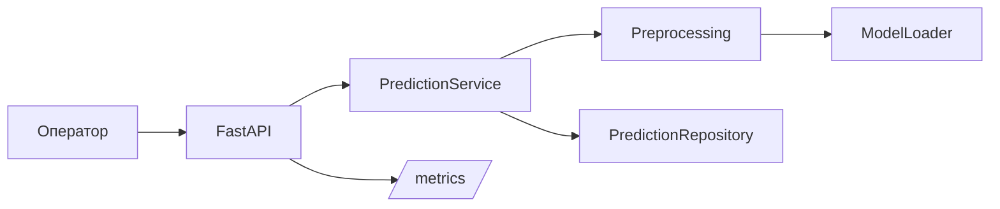

# Лабораторная работа №2 — Predictive Maintenance

Небольшой учебный сервис для предиктивного обслуживания оборудования. Сервис принимает несколько показателей оборудования и возвращает оценку риска. Основной сценарий — оператор отправляет данные, получает результат и при необходимости передаёт оборудование на ручную проверку.

## Что сделано

В проекте есть четыре основных части:

- API на FastAPI;
- проверка входных данных через Pydantic;
- отдельные модули для подготовки признаков и расчёта результата;
- простое хранение результатов и технические метрики.

Проект собран как модульный монолит. Все части запускаются в одном приложении.

## Границы системы

Сервис отвечает за приём телеметрии, проверку данных, расчёт прогноза, применение простого бизнес-правила и сохранение результата.

В проект не входит управление оборудованием, бухгалтерия и автоматическое принятие производственных решений.

### Используемые показатели

Для примера используются:

- температура;
- амплитуда вибрации;
- наработка в часах;
- количество ошибок за последние 24 часа.

Для ответа сохраняются `request_id` и `model_version`.

## Архитектура

Использован модульный монолит. Для учебной работы это проще, чем сразу разносить API, модель и хранение по разным сервисам.



Основной путь запроса:

```text
POST /api/v1/predict
        ↓
   проверка API key
        ↓
     Pydantic
        ↓
   preprocessing
        ↓
      модель
        ↓
 бизнес-правило
        ↓
 сохранение результата
        ↓
      JSON
```

## API

### `POST /api/v1/predict`

Нужен заголовок `X-API-Key`.

Пример запроса:

```json
{
  "item_id": "PUMP_UNIT_42",
  "temperature": 82.5,
  "vibration_amplitude": 4.12,
  "operating_hours": 1420,
  "error_code_last_24h": 12
}
```

Пример ответа:

```json
{
  "request_id": "...",
  "item_id": "PUMP_UNIT_42",
  "prediction": "WARNING_ANOMALY",
  "probability": 0.84,
  "model_version": "1.0.0",
  "manual_review_required": false
}
```

### `GET /health`

Показывает состояние приложения и загружена ли модель.

### `GET /metrics`

Отдаёт метрики Prometheus.

## Структура проекта

```text
ai-system-predictive-maintenance/
├── app/
│   ├── api/              # HTTP и схемы запросов
│   ├── core/             # настройка логирования
│   ├── data/             # задел под данные
│   ├── ml/               # preprocessing и модель
│   ├── repositories/     # хранение результатов
│   └── services/         # основная логика
├── docs/
│   ├── architecture.md
│   └── adr/
├── tests/
├── Dockerfile
├── requirements.txt
└── README.md
```

## Запуск в PyCharm

В терминале проекта:

```bash
python -m venv .venv
```

Windows:

```bash
.venv\\Scripts\\activate
```

После этого:

```bash
pip install -r requirements.txt
uvicorn app.main:app --reload
```

Документация API будет доступна по адресу `http://127.0.0.1:8000/docs`.

Для тестов:

```bash
pytest -q
```

## Docker

Собрать образ:

```bash
docker build -t predictive-maintenance .
```

Запустить:

```bash
docker run -p 8000:8000 predictive-maintenance
```

## ADR

- [ADR-01 — способ вызова модели](docs/adr/ADR-01-inference-mode.md)
- [ADR-02 — хранение модели](docs/adr/ADR-02-model-artifacts.md)
- [ADR-03 — архитектурный стиль](docs/adr/ADR-03-architecture-style.md)

## Что осталось упрощённым

В проекте нет настоящего обученного файла модели. `ModelLoader` содержит небольшой расчёт риска и нужен именно для демонстрации места, где в реальном проекте выполнялся бы инференс.

Хранилище результатов сейчас работает в памяти. Для реального сервиса его можно заменить на PostgreSQL или другое постоянное хранилище.
