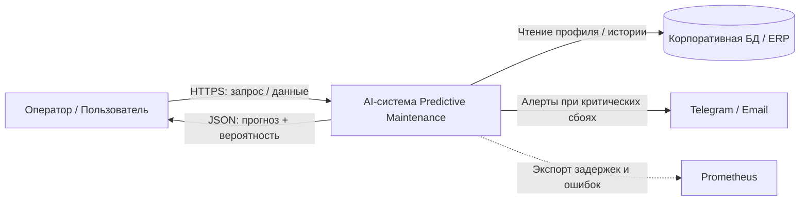
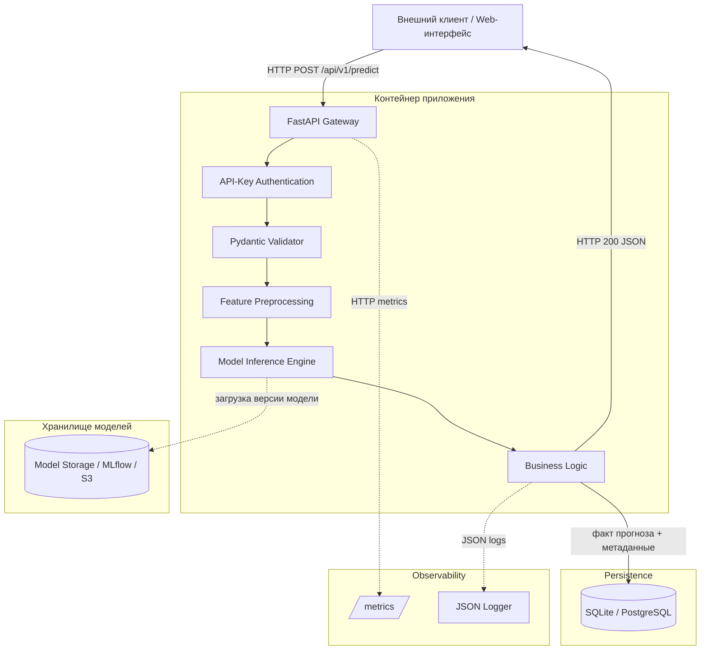

# AI System — Predictive Maintenance

Лабораторная работа №2: проектирование архитектуры программной AI-системы для предиктивного обслуживания оборудования.

## 1. Контекст и бизнес-проблема

Система предназначена для анализа телеметрии оборудования (температура, вибрация, наработка, код последней ошибки) и выдачи прогноза риска аварийного состояния. Потребитель результата — оператор/диспетчер и внешняя корпоративная система.

Бизнес-цель: сократить число аварийных простоев за счёт раннего выявления аномалий и передачи оператору признака необходимости ручной проверки.

## 2. Границы и требования

**Входит:** валидация входных данных, предобработка, инференс, бизнес-правила, API, логирование, локальное хранение фактов инференса, мониторинг.

**Не входит:** физическое управление станками, бухгалтерские операции, юридическое утверждение приказов.

### Метрики
- Бизнес: снижение аварийных простоев.
- SLA: инференс одного объекта на CPU ≤ 150 мс.
- Качество модели: precision/recall/F1; для конкретной обученной модели значения должны быть зафиксированы после валидации.
- Воспроизводимость: `request_id`, `model_version` в каждом ответе.

## 3. Архитектурный стиль

Выбран **модульный монолит** в одном Docker-контейнере на FastAPI. Такой стиль соответствует учебному заданию: внутренние модули разделены явными контрактами, при этом отсутствуют лишние сетевые задержки и упрощаются локальная отладка и тестирование.

## 4. System Context — Mermaid



## 5. Component Diagram — Mermaid



## 6. Потоки данных

| Поток | Протокол | Формат | Частота |
|---|---|---|---|
| Клиент → `/predict` | HTTPS/REST | JSON | По запросу |
| API → БД | SQL/SQLAlchemy | реляционные записи | На каждый успешный инференс |
| Inference → Model Storage | файловый/S3/MLflow API | модельный артефакт | При загрузке/смене версии |
| API → Prometheus | HTTP scrape | OpenMetrics | Периодически |
| Business Logic → Logger | stdout/file | JSON | На каждый запрос |
| Система → уведомления | HTTPS | JSON/text | При критическом событии |

## 7. REST API

### `POST /api/v1/predict`

Headers: `Content-Type: application/json`, `X-API-Key: <secret_token>`.

Пример запроса:

```json
{
  "item_id": "PUMP_UNIT_42",
  "temperature": 82.5,
  "vibration_amplitude": 4.12,
  "operating_hours": 1420,
  "error_code_last_24h": 12
}
```

Пример ответа:

```json
{
  "request_id": "9b1deb4d-3b7d-4bad-9bdd-2b0d7b3dcb6d",
  "item_id": "PUMP_UNIT_42",
  "prediction": "WARNING_ANOMALY",
  "probability": 0.84,
  "model_version": "1.0.0",
  "manual_review_required": false
}
```

Ошибки валидации: HTTP 400/422 с указанием поля и причины.

### `GET /health`

Возвращает статус сервиса, состояние загрузки модели, версию модели и uptime.

### `GET /metrics`

Prometheus/OpenMetrics endpoint.

## 8. Компоненты

| Компонент | Назначение | Вход | Выход |
|---|---|---|---|
| `app.api.routes` | HTTP-обработка | HTTP request | HTTP response |
| `app.api.schemas` | Pydantic-валидация | JSON | типизированная модель |
| `app.ml.preprocessing` | трансформация признаков | dict | numpy array |
| `app.ml.inference` | инференс | признаки | prediction + probability |
| `app.services.prediction` | бизнес-правила/fallback | запрос + вердикт | бизнес-результат |
| `app.repositories` | персистентность | prediction entity | запись в БД |

## 9. ADR

- [ADR-01: Синхронный REST inference](docs/adr/ADR-01-inference-mode.md)
- [ADR-02: Версионирование моделей](docs/adr/ADR-02-model-artifacts.md)
- [ADR-03: Модульный монолит](docs/adr/ADR-03-architecture-style.md)

## 10. Безопасность и наблюдаемость

- Аутентификация: `X-API-Key`.
- Payload size limit: до 2 МБ.
- Тайм-ауты запросов.
- Персональные данные не передаются в незашифрованном виде; идентификаторы маскируются перед инференсом.
- JSON-логи с `timestamp`, `request_id`, `item_id`, `latency_ms`, `status`, `prediction`, `model_version`.
- Prometheus: `http_requests_total`, `http_request_duration_seconds`, `model_inference_duration_seconds`.
- Drift: периодический offline-анализ распределений признаков с KS/PSI через Evidently.

## 11. Train-Serving Skew

Предобработка оформлена отдельным версионируемым модулем. В промышленной эксплуатации один и тот же артефакт трансформаций должен использоваться в обучении и serving, чтобы не допустить расхождения логики признаков.

## 12. Структура репозитория

```text
ai-system-predictive-maintenance/
├── .gitignore
├── LICENSE
├── README.md
├── requirements.txt
├── Dockerfile
├── app/
│   ├── api/
│   ├── core/
│   ├── data/
│   ├── ml/
│   ├── services/
│   └── repositories/
├── docs/
│   ├── architecture.md
│   └── adr/
└── tests/
```

## 13. Запуск

```bash
python -m venv .venv
source .venv/bin/activate  # Windows: .venv\\Scripts\\activate
pip install -r requirements.txt
uvicorn app.main:app --reload
```

Swagger: `http://localhost:8000/docs`.

## 14. Ограничения учебного прототипа

В репозитории нет бинарных весов модели. `ModelLoader` реализован как безопасная заглушка; реальный артефакт модели должен храниться вне Git (S3/MinIO/MLflow/DVC).
